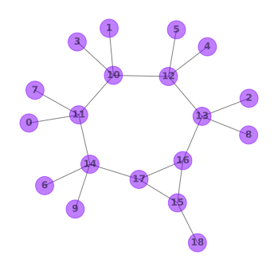
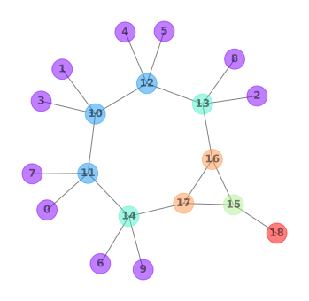
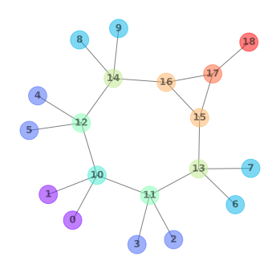

# Initialize graph
<div class="columns">
<div>

Initialize the graph and assign to each node a label, a partition, and an invariant-code. The invariant-code captures features of a node with label $i$ and its neighbors (nodes that are connected to $i$ by a single edge). Consider for example, the invariant-code of node `16`. The leading `6` is the atomic number and indicates that the node represents a carbon atom. Further, we can infer that the node is part of two fundamental cycles: `2` and `1`. Note that all nodes carry a trailing `0` in their invariant-codes. The `0`s are placeholders in case a node does not belong to a fundamental cycle. The invariant-code continues with a slash-separated list of $i$'s neighbors.


</div>
<div>

| label | partition | invariant-code                      |
|-------|-----------|-------------------------------------|
| 0     | 0         | 1-0 / 6-1,0                         |
| 1     | 0         | 1-0 / 6-1,0                         |
| 2     | 0         | 1-0 / 6-1,0                         |
| 3     | 0         | 1-0 / 6-1,0                         |
| 4     | 0         | 1-0 / 6-1,0                         |
| 5     | 0         | 1-0 / 6-1,0                         |
| 6     | 0         | 1-0 / 6-1,0                         |
| 7     | 0         | 1-0 / 6-1,0                         |
| 8     | 0         | 1-0 / 6-1,0                         |
| 9     | 0         | 1-0 / 6-1,0                         |
| 10    | 0         | 6-1,0 / 6-1,0 / 6-1,0 / 1-0 / 1-0   |
| 11    | 0         | 6-1,0 / 6-1,0 / 6-1,0 / 1-0 / 1-0   |
| 12    | 0         | 6-1,0 / 6-1,0 / 6-1,0 / 1-0 / 1-0   |
| 13    | 0         | 6-1,0 / 6-2,1,0 / 6-1,0 / 1-0 / 1-0 |
| 14    | 0         | 6-1,0 / 6-2,1,0 / 6-1,0 / 1-0 / 1-0 |
| 15    | 0         | 6-2,0 / 8-0 / 6-2,1,0 / 6-2,1,0     |
| 16    | 0         | 6-2,1,0 / 6-2,1,0 / 6-2,0 / 6-1,0   |
| 17    | 0         | 6-2,1,0 / 6-2,1,0 / 6-2,0 / 6-1,0   |
| 18    | 0         | 8-0 / 6-2,0                         |
</div>
</div>


---


# Partition graph by invariant-code
<div class="columns">
<div>

If two nodes have identical invariant-codes, put them in the same partition.


</div>
<div>

| label | partition | invariant-code                      |
|-------|-----------|-------------------------------------|
| 0     | 0         | 1-0 / 6-1,0                         |
| 1     | 0         | 1-0 / 6-1,0                         |
| 2     | 0         | 1-0 / 6-1,0                         |
| 3     | 0         | 1-0 / 6-1,0                         |
| 4     | 0         | 1-0 / 6-1,0                         |
| 5     | 0         | 1-0 / 6-1,0                         |
| 6     | 0         | 1-0 / 6-1,0                         |
| 7     | 0         | 1-0 / 6-1,0                         |
| 8     | 0         | 1-0 / 6-1,0                         |
| 9     | 0         | 1-0 / 6-1,0                         |
| 10    | 1         | 6-1,0 / 6-1,0 / 6-1,0 / 1-0 / 1-0   |
| 11    | 1         | 6-1,0 / 6-1,0 / 6-1,0 / 1-0 / 1-0   |
| 12    | 1         | 6-1,0 / 6-1,0 / 6-1,0 / 1-0 / 1-0   |
| 13    | 2         | 6-1,0 / 6-2,1,0 / 6-1,0 / 1-0 / 1-0 |
| 14    | 2         | 6-1,0 / 6-2,1,0 / 6-1,0 / 1-0 / 1-0 |
| 15    | 3         | 6-2,0 / 8-0 / 6-2,1,0 / 6-2,1,0     |
| 16    | 4         | 6-2,1,0 / 6-2,1,0 / 6-2,0 / 6-1,0   |
| 17    | 4         | 6-2,1,0 / 6-2,1,0 / 6-2,0 / 6-1,0   |
| 18    | 5         | 8-0 / 6-2,0                         |
</div>
</div>


---
<!-- _footer: $^1$ 10.18154/RWTH-2020-03508 -->


# Refine partitions

Refine the partitions by applying the 1-dimensional Weisfeiler-Lehman algorithm$^1$:

Assign nodes $i$ and $j$ to different partitions iff $i$ and $j$ are connected to different multisets of partitions. Repeat this until no node can be assigned to a new partition anymore. 

For example, in the left graph, consider the nodes $0$ through $9$ from the purple partition. $\{2,6,8,9\}$ are connected to the mint-green partition, whereas $\{0,1,3,4,5,7\}$ are connected to the blue partition. Therefore, we can split the purple partition into two new partitions, purple and blue, as shown in the middle graph.

Likewise, consider the blue partition in the left graph. Node $10$ is connected to the purple and blue partition, whereas $\{11, 12\}$ are connected to the purple, blue, and mint-green partition. We can split the blue partition as shown in the middle graph.


---
<!-- _footer: $^1$ https://en.wikipedia.org/wiki/Breadth-first_search -->


# Canonicalize the graph

<div class="columns">
<div>

Starting at node `0`, traverse the graph in breadth-first-search-order$^1$, while adhering to the following branching priorities:

At node $i$ from partition $P$, branch to the smallest-labeled neighbor from...
1. ... smaller partition than $i$
2. ... greater partition than $i$
3. ... same partition as $i$

Swap the labels such that $i$ gets assigned the smallest-available label $j$ that remains in $P$ (once assigned, removed $j$ from $P$).

On the right we show the first ten steps of the traversal.

$i(P)$ denotes node $i$ from partition $P$.

$i(P):j$ means "swap node $i$ from partition $P$ against node $j$" (note that swaps only happen within the same partition).

</div>
<div>

```
            0(0)
            │
            │1
            │
            ▼
┌──────────10(3)──────────────────────┐
│           │                         │
│2          │3                        │4
│           │                         │
▼           ▼                         ▼
1(0)  ┌────11(4)─────┐        ┌──────12(4)─────┐
      │     │        │        │       │        │
      │5    │6       │7       │8      │9       │10
      │     │        │        │       │        │
      ▼     ▼        ▼        ▼       ▼        ▼
      2(1)  5(1):3  14(5):13  3(1):4  4(1):5  13(5):14
                     │                         │
                     │                         │
                     │                         │
                     ▼                         ▼
                    ...                       ...
```




</div>
</div>


---
<!-- _footer: $^1$ https://en.wikipedia.org/wiki/Chemical_formula#Hill_system -->


# Serialize

Serialize the graph as the sum formula (arranged according to the Hill system$^1$), followed by a sequence of 2-tuples. Each tuple represents the labels of two connected nodes.

`C8H10O/1-11/2-11/3-12/4-12/5-13/6-13/7-14/8-14/9-15/10-15/11-12/11-13/12-14/13-15/14-16/15-17/16-17/16-18/17-18/18-19`

In order to be able to reconstruct the molecule based on this representation, we organize the tuples such that increasing node labels pertain to nodes with increasing atomic number. This means that we can infer the atomic number associated with a node label from the sum formula. For example, the sum formula above indicates that the molecule consists of 10 hydrogens, eight carbons, and one oxygen. Since increasing labels pertain to nodes with increasing atomic numbers, we can infer that the labels 1 through 10 pertain to hydrogens, whereas labels 11 through 18 refer to carbons, and finally, label 19 refers to the oxygen.
