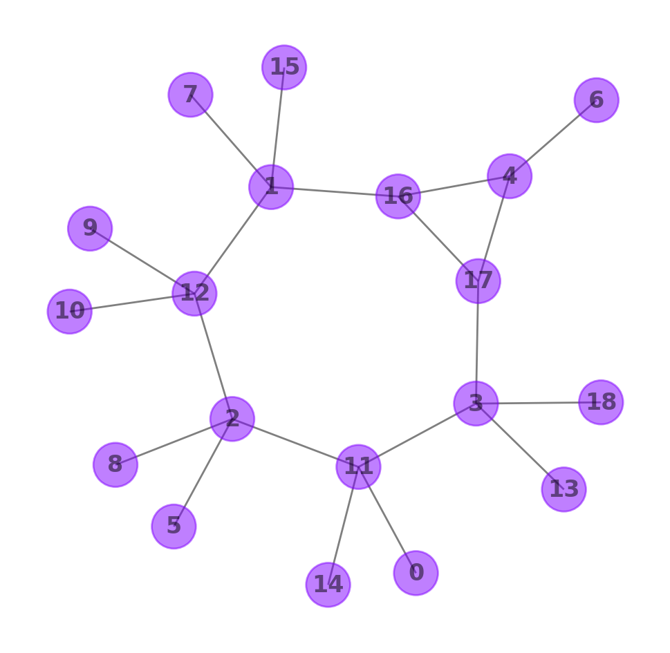
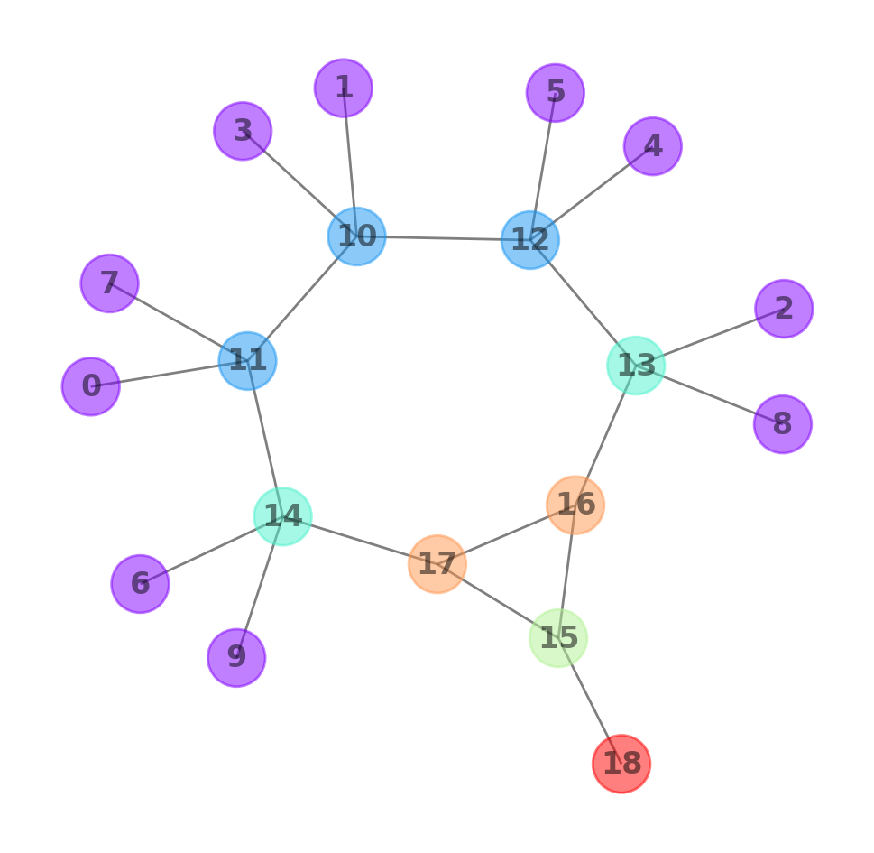
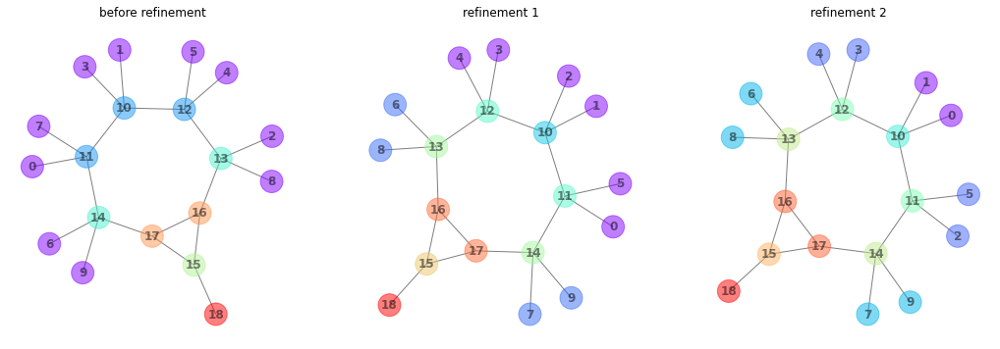
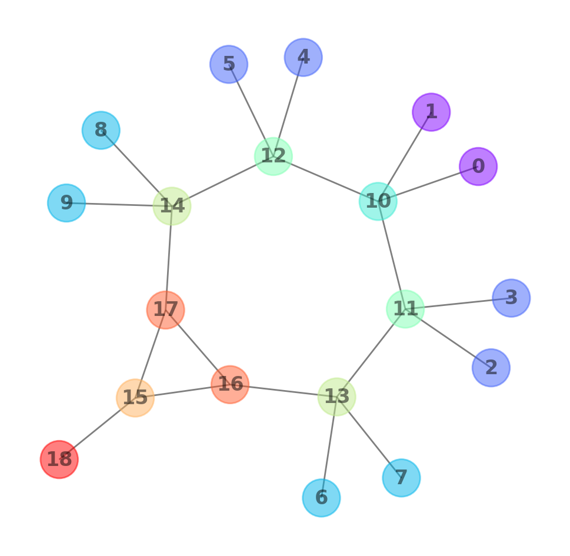

# Initialize graph

| label   | partition   | invariant-code   | extended invariant-code     |
|---------|-------------|------------------|-----------------------------|
| 0       | 0           | 1-0              | 6-1,0                       |
| 1       | 0           | 1-0              | 6-1,0                       |
| 2       | 0           | 1-0              | 6-1,0                       |
| 3       | 0           | 1-0              | 6-1,0                       |
| 4       | 0           | 1-0              | 6-1,0                       |
| 5       | 0           | 1-0              | 6-1,0                       |
| 6       | 0           | 1-0              | 6-1,0                       |
| 7       | 0           | 1-0              | 6-1,0                       |
| 8       | 0           | 1-0              | 6-1,0                       |
| 9       | 0           | 1-0              | 6-1,0                       |
| 10      | 0           | 6-1,0            | 6-1,0 / 6-1,0 / 1-0 / 1-0   |
| 11      | 0           | 6-1,0            | 6-1,0 / 6-1,0 / 1-0 / 1-0   |
| 12      | 0           | 6-1,0            | 6-1,0 / 6-1,0 / 1-0 / 1-0   |
| 13      | 0           | 6-1,0            | 6-2,1,0 / 6-1,0 / 1-0 / 1-0 |
| 14      | 0           | 6-1,0            | 6-2,1,0 / 6-1,0 / 1-0 / 1-0 |
| 15      | 0           | 6-2,0            | 8-0 / 6-2,1,0 / 6-2,1,0     |
| 16      | 0           | 6-2,1,0          | 6-2,1,0 / 6-2,0 / 6-1,0     |
| 17      | 0           | 6-2,1,0          | 6-2,1,0 / 6-2,0 / 6-1,0     |
| 18      | 0           | 8-0              | 6-2,0                       |

---

# Partition by invariant-code

| label   | partition   | invariant-code   | extended invariant-code     |
|---------|-------------|------------------|-----------------------------|
| 0       | 0           | 1-0              | 6-1,0                       |
| 1       | 0           | 1-0              | 6-1,0                       |
| 2       | 0           | 1-0              | 6-1,0                       |
| 3       | 0           | 1-0              | 6-1,0                       |
| 4       | 0           | 1-0              | 6-1,0                       |
| 5       | 0           | 1-0              | 6-1,0                       |
| 6       | 0           | 1-0              | 6-1,0                       |
| 7       | 0           | 1-0              | 6-1,0                       |
| 8       | 0           | 1-0              | 6-1,0                       |
| 9       | 0           | 1-0              | 6-1,0                       |
| 10      | 1           | 6-1,0            | 6-1,0 / 6-1,0 / 1-0 / 1-0   |
| 11      | 1           | 6-1,0            | 6-1,0 / 6-1,0 / 1-0 / 1-0   |
| 12      | 1           | 6-1,0            | 6-1,0 / 6-1,0 / 1-0 / 1-0   |
| 13      | 2           | 6-1,0            | 6-2,1,0 / 6-1,0 / 1-0 / 1-0 |
| 14      | 2           | 6-1,0            | 6-2,1,0 / 6-1,0 / 1-0 / 1-0 |
| 15      | 3           | 6-2,0            | 8-0 / 6-2,1,0 / 6-2,1,0     |
| 16      | 4           | 6-2,1,0          | 6-2,1,0 / 6-2,0 / 6-1,0     |
| 17      | 4           | 6-2,1,0          | 6-2,1,0 / 6-2,0 / 6-1,0     |
| 18      | 5           | 8-0              | 6-2,0                       |

---

# Refine partitions

TODO: explain refinement / Weisfeiler-Lehman

| before refinement | |                   |---| refinement 1 | |                        |---| refinement 2 | |                        |
|-------|-----------|---------------------|---|-------|-----------|---------------------|---|-------|-----------|---------------------|
| label | partition | neighbor partitions |---| label | partition | neighbor partitions |---| label | partition | neighbor partitions |
| 0     | 0         | 1                   |---| 0     | 0         | 2                   |---| 0     | 0         | 3                   |
| 1     | 0         | 1                   |---| 1     | 0         | 2                   |---| 1     | 0         | 3                   |
| 2     | 0         | 1                   |---| 2     | 0         | 3                   |---| 2     | 1         | 4                   |
| 3     | 0         | 1                   |---| 3     | 0         | 3                   |---| 3     | 1         | 4                   |
| 4     | 0         | 1                   |---| 4     | 0         | 3                   |---| 4     | 1         | 4                   |
| 5     | 0         | 1                   |---| 5     | 0         | 3                   |---| 5     | 1         | 4                   |
| 6     | 0         | 2                   |---| 6     | 1         | 4                   |---| 6     | 2         | 5                   |
| 7     | 0         | 2                   |---| 7     | 1         | 4                   |---| 7     | 2         | 5                   |
| 8     | 0         | 2                   |---| 8     | 1         | 4                   |---| 8     | 2         | 5                   |
| 9     | 0         | 2                   |---| 9     | 1         | 4                   |---| 9     | 2         | 5                   |
| 10    | 1         | 1 / 1 / 0 / 0       |---| 10    | 2         | 3 / 3 / 0 / 0       |---| 10    | 3         | 4 / 4 / 0 / 0       |
| 11    | 1         | 2 / 1 / 0 / 0       |---| 11    | 3         | 4 / 2 / 0 / 0       |---| 11    | 4         | 5 / 3 / 1 / 1       |
| 12    | 1         | 2 / 1 / 0 / 0       |---| 12    | 3         | 4 / 2 / 0 / 0       |---| 12    | 4         | 5 / 3 / 1 / 1       |
| 13    | 2         | 4 / 1 / 0 / 0       |---| 13    | 4         | 6 / 3 / 1 / 1       |---| 13    | 5         | 7 / 4 / 2 / 2       |
| 14    | 2         | 4 / 1 / 0 / 0       |---| 14    | 4         | 6 / 3 / 1 / 1       |---| 14    | 5         | 7 / 4 / 2 / 2       |
| 15    | 3         | 5 / 4 / 4           |---| 15    | 5         | 7 / 6 / 6           |---| 15    | 6         | 8 / 7 / 7           |
| 16    | 4         | 4 / 3 / 2           |---| 16    | 6         | 6 / 5 / 4           |---| 16    | 7         | 7 / 6 / 5           |
| 17    | 4         | 4 / 3 / 2           |---| 17    | 6         | 6 / 5 / 4           |---| 17    | 7         | 7 / 6 / 5           |
| 18    | 5         | 3                   |---| 18    | 7         | 5                   |---| 18    | 8         | 6                   |

---

---

# Canonicalize

TODO: visualize traversal (e.g., BFS tree) and swaps.

---

# Serialize

TODO: explain
`C8H10O/1-11/2-11/3-12/4-12/5-13/6-13/7-14/8-14/9-15/10-15/11-12/11-13/12-14/13-15/14-16/15-17/16-17/16-18/17-18/18-19`
